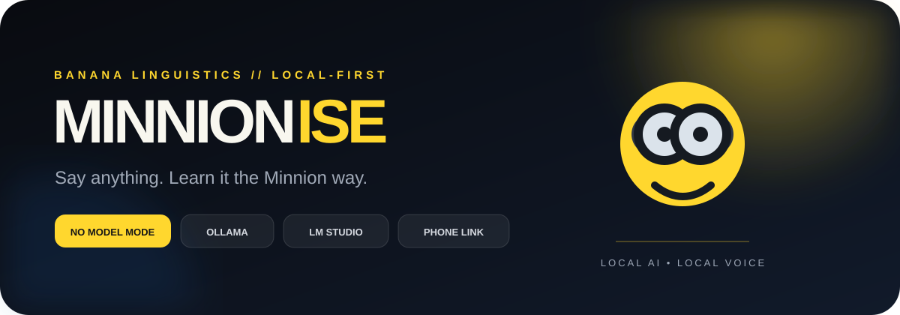
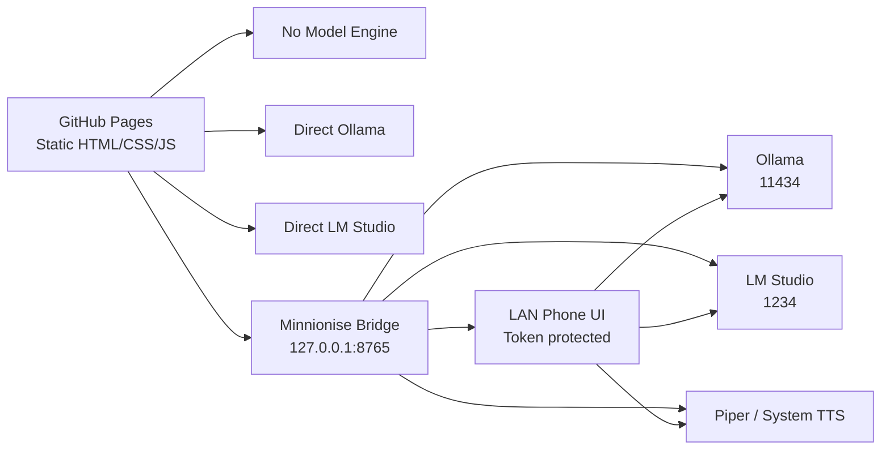

<div align="center">
  

  <br />

  [](https://sukantsondhi.github.io/minnionise/)
  [](https://github.com/sukantsondhi/minnionise/actions)
  [](https://www.python.org/)
  [](#local-first-by-design)
  [](LICENSE)

  **A futuristic local-first pronunciation lab that turns ordinary sentences into playful Minnionese — using no model at all, or the models already running on your own devices.**

  [Launch Minnionise](https://sukantsondhi.github.io/minnionise/) · [Setup guide](docs/SETUP.md) · [Architecture](docs/ARCHITECTURE.md) · [Phone pairing](docs/PHONE_PAIRING.md) · [Security](docs/SECURITY.md)
</div>

---

## ✨ What makes Minnionise different?

Minnionise is designed around **progressive local AI**. It never forces a model download or cloud API before the user can do anything.

| Mode | What runs | Setup | Best for |
|---|---|---:|---|
| **◌ No Model** | Deterministic browser-local phrase engine + browser speech | None | Instant use, offline logic, demos |
| **◒ Ollama** | Your local Ollama LLM | Ollama | Easiest desktop AI path |
| **LM Studio** | Your local OpenAI-compatible LM Studio server | LM Studio | GUI-first model management |
| **M Bridge** | Python bridge → Ollama/LM Studio + Piper/system TTS | One local script | Best desktop experience + iPhone pairing |
| **📱 Phone Link** | iPhone/iPad browser → your desktop over LAN | `--lan` + QR | Use desktop models from mobile |

### Product experience

- **No Model / My Model toggle** — the UI behaves differently depending on the selected power level.
- **Local provider discovery** — detects Ollama, LM Studio and the Minnionise Bridge.
- **Model picker** — select any discovered local model.
- **Four translation personalities** — Gentle, Classic, Chaos and Teacher.
- **Pronunciation view** — simple phonetics plus tap-to-practise chunks.
- **Voice coach** — normal, slow and repeat modes.
- **Local microphone practice** — record yourself without uploading audio.
- **History + favourites** — stored in browser `localStorage` only.
- **Copy + Web Share** — export a result quickly.
- **PWA support** — installable on supported desktop/mobile browsers.
- **Offline application shell** — service worker caches the static app.
- **iPhone/iPad QR pairing** — desktop bridge serves a token-protected mobile UI over local Wi-Fi.
- **Responsive UI** — designed for laptop, desktop, iPad, tablet and phone layouts.
- **Accessibility** — semantic controls, keyboard shortcut and reduced-motion support.

---

## 🚀 Quick start

### Option A — zero setup

Open the [live site](https://sukantsondhi.github.io/minnionise/) and leave **No Model** selected.

Everything needed for basic transformation is already in the static JavaScript application.

### Option B — Ollama

1. Install and start [Ollama](https://ollama.com/).
2. Pull/run a model, for example:

```bash
ollama run qwen3:8b
```

3. In Minnionise choose **My Model → Ollama → your model**.

> A browser-hosted GitHub Pages app may need an allowed web origin for direct Ollama access. The **Minnionise Bridge** avoids that problem by proxying Ollama locally.

### Option C — LM Studio

Start the local server with CORS enabled:

```bash
lms server start --cors
```

Then choose **My Model → LM Studio** in Minnionise.

### Option D — recommended full experience

Clone the repo and run the standard-library Python bridge:

```bash
git clone https://github.com/sukantsondhi/minnionise.git
cd minnionise
python local_bridge/server.py
```

No `pip install` is required.

The bridge automatically checks:

```text
Ollama     → http://127.0.0.1:11434
LM Studio  → http://127.0.0.1:1234
Piper      → common local model directories
System TTS → Windows / macOS / Linux
```

On Windows you can also double-click:

```text
local_bridge/start_windows.bat
```

---

## 📱 iPhone / iPad — QR Phone Link

Run:

```bash
python local_bridge/server.py --lan
```

Then in the desktop web app choose **Pair by QR**.

```text
GitHub Pages desktop UI
          │
          │ localhost
          ▼
Minnionise Bridge :8765
          │
          ├────────► Ollama / LM Studio
          ├────────► Piper / system voice
          │
          └── local Wi‑Fi + random token
                        │
                        ▼
                 iPhone / iPad
                 Minnionise Mobile
```

The QR code opens a mobile UI **served directly by your computer**. This intentionally avoids requiring an HTTPS GitHub Pages tab on iPhone to make mixed-content requests to an HTTP LAN address.

See [Phone Pairing](docs/PHONE_PAIRING.md).

---

## 🧠 Local-first by design

Minnionise separates two responsibilities:

### Language brain

- No Model engine
- Ollama
- LM Studio

### Voice engine

- Browser Speech Synthesis
- Piper
- Windows system voice
- macOS `say`
- eSpeak / eSpeak NG

That separation means a user can use a powerful local LLM without installing a TTS model — or use local TTS while leaving the language side in No Model mode.

---

## 🏗 Architecture



Full details: [docs/ARCHITECTURE.md](docs/ARCHITECTURE.md)

---

## 🔐 Security model

The local bridge is deliberately conservative:

- defaults to `127.0.0.1` only;
- LAN exposure happens only with `--lan`;
- non-loopback clients require a cryptographically random pairing token;
- the browser cannot submit arbitrary shell commands;
- provider targets are fixed to localhost Ollama and LM Studio endpoints;
- GitHub Pages origin is explicitly allowlisted instead of using `Access-Control-Allow-Origin: *`;
- prompts are not stored by Minnionise Bridge;
- recordings made by the web UI stay in the browser tab.

See [docs/SECURITY.md](docs/SECURITY.md).

---

## 📂 Repository layout

```text
minnionise/
├── index.html                  # GitHub Pages application shell
├── styles.css                  # responsive state-of-the-art UI
├── app.js                      # no-model engine + provider integrations
├── manifest.webmanifest        # PWA metadata
├── sw.js                       # offline application-shell cache
├── 404.html                    # GitHub Pages fallback
├── favicon.svg
├── local_bridge/
│   ├── server.py               # local AI/TTS/LAN bridge (stdlib only)
│   ├── start_windows.bat       # one-click Windows launcher
│   ├── start_macos_linux.sh    # macOS/Linux launcher
│   └── README.md
├── docs/
│   ├── ARCHITECTURE.md
│   ├── SETUP.md
│   ├── PROVIDERS.md
│   ├── PHONE_PAIRING.md
│   ├── SECURITY.md
│   └── banner.svg
└── .github/workflows/pages.yml
```

---

## 🌍 GitHub Pages deployment

The repository uses GitHub's official Pages artifact workflow. The web build contains only the static browser files — the Python bridge remains downloadable source code and is **not** executed on GitHub Pages.

Push to `main` and GitHub Actions deploys the site automatically.

The repository's Pages source must be configured as **GitHub Actions**.

---

## 🛣 Roadmap

- [x] No Model translation engine
- [x] Ollama direct connection
- [x] LM Studio direct connection
- [x] bridge-side Ollama / LM Studio proxying
- [x] model picker
- [x] local voice engines
- [x] phone QR pairing
- [x] phone-specific local UI
- [x] local history/favourites
- [x] browser microphone practice
- [x] PWA/offline shell
- [ ] packaged signed desktop helper (`.exe` / `.app`)
- [ ] local Whisper pronunciation scoring
- [ ] selectable Piper/Kokoro voice manager
- [ ] WebGPU browser-model mode
- [ ] Android companion flow

---

## ⚖️ Fan-project notice

Minnionise is an independent, fan-inspired language experiment. It does **not** include official Minions artwork, audio, movie dialogue, or proprietary models, and it is not affiliated with, endorsed by, or sponsored by Illumination or Universal.

## License

MIT — see [LICENSE](LICENSE).
