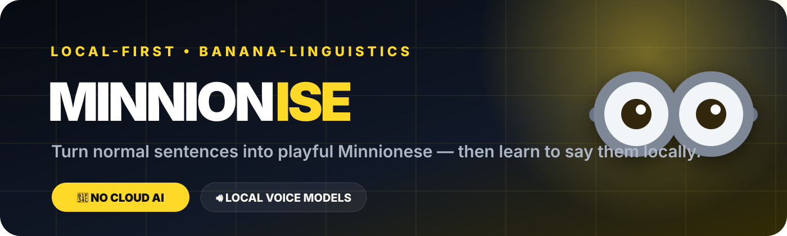

<div align="center">



<br />

# 🍌 Minnionise

### A local-first voice lab for learning gloriously chaotic, fan-inspired Minnionese.

Turn an ordinary sentence into playful Minnion-style speech, break it into easy pronunciation chunks, and hear it spoken using **voice engines running on your own computer**.

[](https://sukantsondhi.github.io/minnionise/)
[](https://github.com/sukantsondhi/minnionise/actions/workflows/pages.yml)
[](local_bridge/server.py)
[](#-local-first-by-design)

**No account · No cloud AI required · No paid hosting · Just bananas.**

</div>

---

## ✨ What is Minnionise?

Minnionise is a small experimental web app that transforms English into **playful, fan-inspired Minnionese** and helps you practise saying the result.

The public interface is deliberately tiny: **one HTML file, vanilla JavaScript, vanilla CSS, and a lightweight Python bridge** for local voice engines. The site can live entirely on GitHub Pages, while speech synthesis stays on the user's own machine whenever the local bridge is running.

```text
     YOU
      │
      ▼
"Good morning, my friend!"
      │
      ▼
  🍌 MINNIONISE
      │
      ├── Soft
      ├── Classic
      └── Chaos
      │
      ▼
  Playful Minnionese
      │
      ├── pronunciation chunks
      ├── speed control
      └── tap-to-hear words
      │
      ▼
 🔊 LOCAL VOICE ENGINE
```

## 🚀 Features

| Feature | What it does |
|---|---|
| 🍌 **Minnionise Engine** | Transforms normal sentences into playful fan-inspired Minnionese |
| 🎛️ **3 Translation Modes** | Choose **Soft**, **Classic**, or full **Chaos** |
| 🔊 **Local Voice Playback** | Speaks results using models and system voices on your machine |
| 🧠 **Piper Discovery** | Detects local Piper `.onnx` models in common model directories |
| 🪟 **Windows Voice Support** | Uses Windows SAPI when available |
| 🍎 **macOS Voice Support** | Detects voices exposed by macOS `say` |
| 🐧 **Linux Voice Support** | Detects eSpeak / eSpeak-NG voices |
| 🌐 **Browser Fallback** | Falls back to the browser Speech Synthesis API when the bridge is offline |
| 🧩 **Pronunciation Chips** | Tap individual words/chunks to hear them separately |
| ⚡ **Speed Control** | Slow the voice down while learning pronunciation |
| 🕘 **Local History** | Stores recent transformations in browser `localStorage` |
| 📱 **Responsive UI** | Designed for desktop, laptop, tablets/iPad, and mobile screens |
| 🔐 **Local-first Architecture** | Text-to-speech can stay entirely on the user's device |

## 🖥️ Interface

Minnionise uses a futuristic dark UI with yellow accents inspired by goggles, lab equipment, and banana-powered chaos.

The app dynamically adapts between:

- desktop and ultrawide layouts
- laptops
- iPad and Android tablets
- landscape and portrait mobile screens

There is no frontend framework and no build process.

## 🧠 Local-first by design

The hosted GitHub Pages site is only the interface.

When the local bridge is running, the browser talks to:

```text
http://127.0.0.1:8765
```

The bridge binds to **loopback only** and exposes three tiny operations:

```text
GET  /api/health
GET  /api/models
POST /api/speak
```

That means the architecture stays simple:

```text
┌─────────────────────────────────────┐
│         GitHub Pages UI             │
│  HTML + CSS + Vanilla JavaScript    │
└─────────────────┬───────────────────┘
                  │ localhost
                  ▼
┌─────────────────────────────────────┐
│       Python Local Voice Bridge     │
│          127.0.0.1:8765             │
├─────────────────────────────────────┤
│ Piper │ SAPI │ macOS say │ eSpeak   │
└─────────────────────────────────────┘
```

If the bridge cannot be reached, Minnionise automatically uses a **browser-local voice** instead.

## ⚡ Quick start

### Option A — use the hosted UI

Open:

**https://sukantsondhi.github.io/minnionise/**

The basic translator works immediately. For locally installed voice engines, run the bridge below.

### Option B — run everything locally

Clone the repository:

```bash
git clone https://github.com/sukantsondhi/minnionise.git
cd minnionise
```

Start the local voice bridge:

```bash
python local_bridge/server.py
```

Then serve the UI from another terminal:

```bash
python -m http.server 8000
```

Open:

```text
http://127.0.0.1:8000
```

## 🎙️ Voice engines

### Piper

Install Piper and make sure the `piper` executable is available on your `PATH`.

Minnionise searches these locations automatically:

```text
~/piper
~/models
~/.local/share/piper
```

You can add more model folders with `MINNIONISE_MODEL_DIRS`.

**macOS / Linux**

```bash
MINNIONISE_MODEL_DIRS="/path/to/models:/another/path" python local_bridge/server.py
```

**Windows PowerShell**

```powershell
$env:MINNIONISE_MODEL_DIRS="C:\Models;D:\VoiceModels"
python local_bridge/server.py
```

### Windows

The bridge exposes the Windows system voice through **SAPI**.

### macOS

Installed voices visible through:

```bash
say -v ?
```

are discovered automatically.

### Linux

If `espeak-ng` or `espeak` is installed, Minnionise detects available English voices automatically.

## 🗂️ Project structure

```text
minnionise/
├── .github/
│   └── workflows/
│       └── pages.yml          # publishing workflow
├── assets/
│   └── minnionise-banner.svg # README artwork
├── local_bridge/
│   └── server.py             # local TTS bridge
├── .nojekyll
├── index.html                # entire responsive web app
└── README.md
```

## 🛠️ Tech stack

<div align="center">

| Layer | Technology |
|---|---|
| UI | HTML5 |
| Styling | Vanilla CSS |
| Browser logic | Vanilla JavaScript |
| Local bridge | Python standard library |
| TTS | Piper / SAPI / `say` / eSpeak / Web Speech API |
| Hosting | GitHub Pages |
| Database | None |
| Cloud backend | None |
| API keys | None |

</div>

## 🌍 GitHub Pages deployment

The repository publishes the static site to a dedicated `gh-pages` branch using GitHub Actions.

For a brand-new repository, GitHub requires a **one-time repository setting** before the public Pages URL exists:

1. Open **Settings → Pages**.
2. Under **Build and deployment**, choose **Deploy from a branch**.
3. Select **`gh-pages`** and **`/(root)`**.
4. Click **Save**.

After that, every push to `main` republishes the site automatically.

## 🔒 Privacy

Minnionise is intentionally local-first.

- No user account is required.
- No API key is embedded in the frontend.
- Recent phrases remain in browser `localStorage`.
- The Python bridge listens only on `127.0.0.1`.
- Local TTS engines receive text directly on the user's computer.
- Browser Speech Synthesis is used as a fallback when no local bridge is available.

## 🧪 Example

```text
English
  ↓
"Hello everyone, I am learning something new today!"

Classic
  ↓
"bello! bello tulaliloo, i am learnin somedin new today banana!"

Then tap ▶ Play pronunciation.
```

## 🗺️ Roadmap

- [ ] richer Minnionese phrase dictionary
- [ ] model search and model favourites
- [ ] waveform visualisation
- [ ] microphone pronunciation comparison
- [ ] Piper model metadata panel
- [ ] offline installable PWA mode
- [ ] shareable Minnionese phrase cards
- [ ] selectable character/voice personalities

## 🤝 Contributing

Ideas, UI improvements, local model integrations, pronunciation rules, and bug fixes are welcome.

1. Fork the repository.
2. Create a feature branch.
3. Make your changes.
4. Open a pull request.

## ⚠️ Disclaimer

Minnionise is an **unofficial fan-inspired experimental project**. It is not affiliated with, endorsed by, or sponsored by Illumination, Universal Pictures, or the creators/rightsholders of the Minions franchise.

“Minionese” in this project is a playful generated approximation for entertainment and experimentation, not an official language implementation.

---

<div align="center">

### 🍌 Bello. Build local. Speak banana.

[**Open Minnionise**](https://sukantsondhi.github.io/minnionise/) · [**View Actions**](https://github.com/sukantsondhi/minnionise/actions) · [**Report an Issue**](https://github.com/sukantsondhi/minnionise/issues)

Made with Python, vanilla JavaScript, local voices, and questionable quantities of banana energy.

</div>
